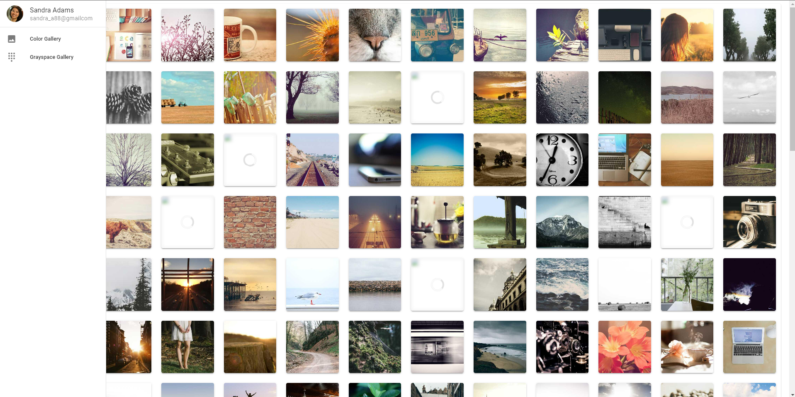

  # Vuetify Image Collection
  
  This application is a simple practice app for the Vuetify library
  
  ## Table of Contents
  
  * [Installation](#installation)
  * [Built With](#built)
  * [Usage Information](#usage)
  * [Authors & Acknowledgements](#credits)
  * [Contact](#questions)
  
  ## Installation
  This application can be accessed from its deployed link on GitHub pages. To run the application locally, after cloning the repository, ensure all dependencies have been installed using "npm i". Then, run "npm run serve" and navigate to the appropriate localhost port to view the application.
  
  ## Built With
  * Vuetify 3
  * Vue 3
  * Vue CLI
  * Lorem Picsum image generator

  ## Usage Information
  [Vuetify Image Collection](tovtc.github.io/laith-vuetify3-tutorial/) 
    
  This application is a quick Vuetify practice application that allows users to view randomly generated images in colour or grayscale, and users can copy the URL of the image to clipboard when the image is clicked. 
    
  
  ## Authors & Acknowledgements
  
  This application was built following the Vuetify tutorial by Laith Academy. 
  Special thanks to [this](https://cli.vuejs.org/guide/deployment.html#github-pages) article on using "sh ./deploy.sh" to deploy Vue apps.
  
  Made by [TOVTC](https://github.com/TOVTC).
 
  ## Questions?
  Contact repository author via [GitHub](https://github.com/TOVTC). 